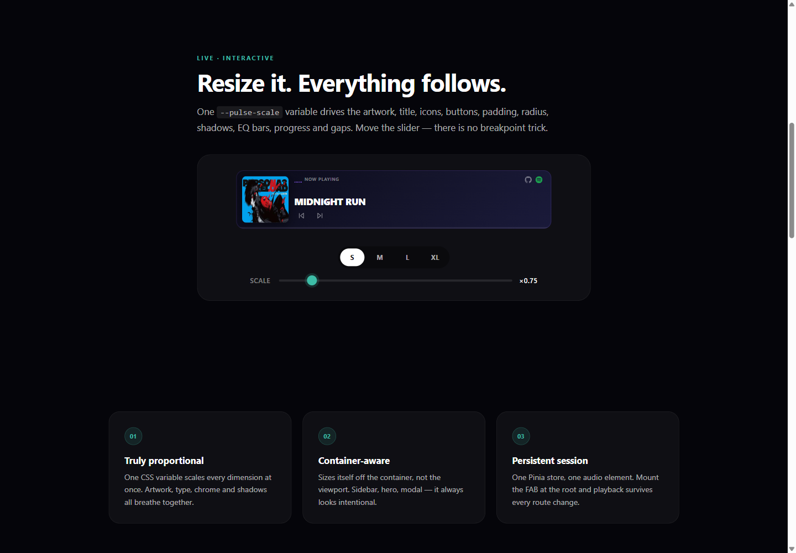
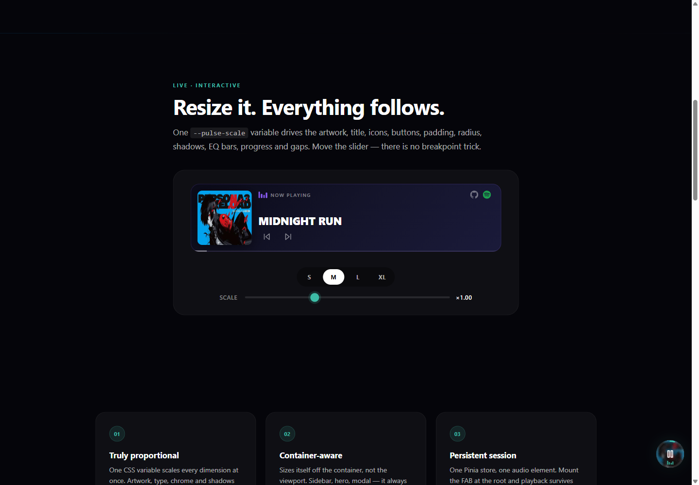
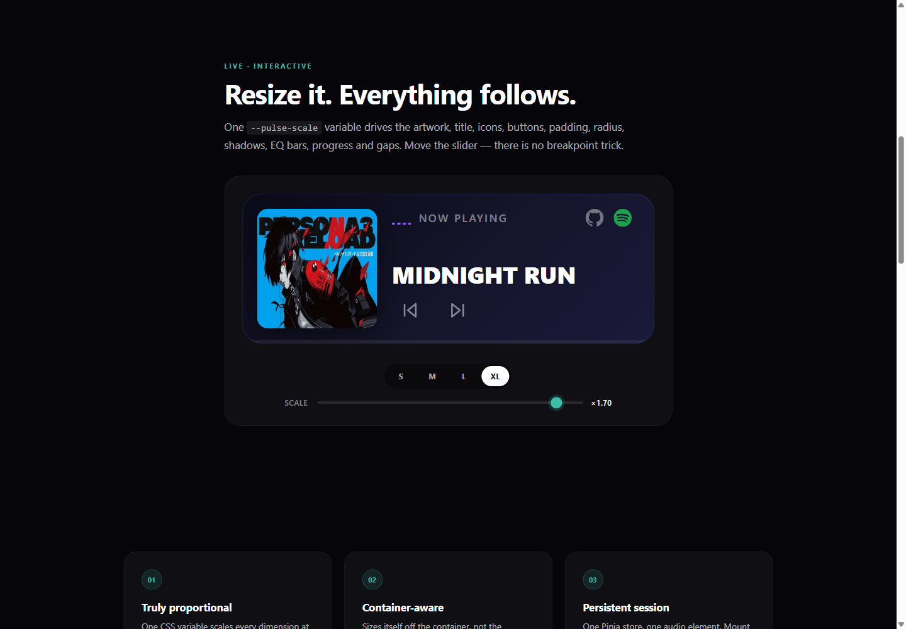

<div align="center">

# pulse-player

**A Vue 3 music player that grows with the page.**
A drop-in inline card and a floating draggable FAB — every visible
dimension scales from a single CSS variable.

[](https://vuejs.org/)
[](https://www.typescriptlang.org/)
[](https://pinia.vuejs.org/)
[](./LICENSE)
[](#dependencies)

<br>


</div>

---

`pulse-player` ships two Vue 3 single-file components — **`MusicPlayer`**
(inline card) and **`MiniPlayer`** (floating FAB) — plus a tiny Pinia store
that owns the audio session.

The unusual bit is the sizing model. Every visible dimension — artwork,
title, NOW PLAYING label, GitHub / Spotify icons, prev / next buttons,
padding, border-radius, shadows, EQ bars, progress bar and gaps — is
derived from a single CSS custom property: `--pulse-scale`. A
ResizeObserver computes it from the container width, or you can override
it with a `size` prop. The result is a player that **actually grows** —
not a stretched mobile one.

```text
container width  →  --pulse-scale
─────────────────────────────────
   240 px        →     0.70   (compact / sidebar)
   360 px        →     0.94   (base)
   480 px        →     1.17
   640 px        →     1.49
   800 px+       →     1.80   (large / hero)
```

## It scales — for real

Same component, three sizes. Title, artwork, icons, padding and chrome all
breathe together.

<table>
  <tr>
    <td align="center" width="33%">
      
      <br><sub><strong>S</strong> · <code>size={0.75}</code></sub>
    </td>
    <td align="center" width="33%">
      
      <br><sub><strong>M</strong> · <code>size={1.0}</code></sub>
    </td>
    <td align="center" width="33%">
      
      <br><sub><strong>XL</strong> · <code>size={1.7}</code></sub>
    </td>
  </tr>
</table>

The demo includes a live slider — open <http://localhost:5174/> after
`npm run dev` and drag the scale knob.

## Variants

Nine curated background presets ship out of the box, plus a `custom`
escape hatch for any CSS background. `accentColor` retunes the EQ bars
+ progress hue.

<table>
  <tr>
    <td align="center" width="50%">
      
      <br><sub><code>variant="auto"</code> — live cover-art blur</sub>
    </td>
    <td align="center" width="50%">
      
      <br><sub><code>variant="vinyl"</code> — warm analog</sub>
    </td>
  </tr>
  <tr>
    <td align="center">
      
      <br><sub><code>variant="sunset"</code> — sepia / brown</sub>
    </td>
    <td align="center">
      
      <br><sub><code>variant="midnight"</code> — deep navy</sub>
    </td>
  </tr>
  <tr>
    <td align="center">
      
      <br><sub><code>variant="aurora"</code> — teal night</sub>
    </td>
    <td align="center">
      
      <br><sub><code>variant="dark"</code> — neutral dark</sub>
    </td>
  </tr>
  <tr>
    <td align="center">
      
      <br><sub><code>variant="light"</code> — light theme</sub>
    </td>
    <td align="center">
      
      <br><sub><code>variant="custom"</code> — your CSS</sub>
    </td>
  </tr>
</table>

There is also a `transparent` variant for placing the player over your own
background.

## Install

```bash
git clone https://github.com/YamadaBlog/pulse-player.git
cd pulse-player
npm install
npm run dev       # http://localhost:5174 — demo with the live size slider
```

To consume the library in your own Vue 3 app, copy [`src/lib/`](./src/lib)
into your project — it has no other source dependency. Then:

```bash
npm install vue pinia lucide-vue-next
```

```ts
// main.ts
import { createApp } from 'vue'
import { createPinia } from 'pinia'
import App from './App.vue'

createApp(App).use(createPinia()).mount('#app')
```

## Usage

```vue
<script setup lang="ts">
import { MusicPlayer, MiniPlayer, useAudioStore } from './lib'

const store = useAudioStore()
</script>

<template>
  <!-- Inline card. Icons (GitHub + Spotify) appear by default. -->
  <MusicPlayer
    variant="sunset"
    accent-color="#F59E0B"
    github-url="https://github.com/your-handle"
    spotify-url="https://open.spotify.com/playlist/..."
  />

  <!-- Your own controls — the store is the only contract. -->
  <button @click="store.toggle">
    {{ store.isPlaying ? 'Pause' : 'Play' }}
  </button>

  <!-- Mount ONCE near the app root — persists across every navigation. -->
  <MiniPlayer variant="vinyl" />
</template>
```

No provider, no plugin registration — Pinia is the only thing that needs
to be installed once at the app root.

## How sizing works

The component watches its own container with a `ResizeObserver`. From the
container width it computes a unitless scale factor (0.70 — 1.80) and writes
it to `--pulse-scale` as an inline style. All dimensions are CSS `calc()`
of a base value × `var(--pulse-scale)`:

```css
.mp {
  --pulse-scale: 1;                       /* set inline by JS */

  --pulse-pad:    calc(14px * var(--pulse-scale));
  --pulse-radius: calc(18px * var(--pulse-scale));
  --pulse-art:    calc(112px * var(--pulse-scale));
  --pulse-title:  calc(22px  * var(--pulse-scale));
  --pulse-icon:   calc(17px  * var(--pulse-scale));
  --pulse-btn:    calc(34px  * var(--pulse-scale));
  --pulse-bar-h:  calc(3px   * var(--pulse-scale));
  /* …and a dozen more — see MusicPlayer.vue */
}
```

Pass the `size` prop (a number) to override the auto-scale entirely:

```vue
<MusicPlayer :size="0.75" />   <!-- compact sidebar -->
<MusicPlayer :size="1.0"  />   <!-- card -->
<MusicPlayer :size="1.7"  />   <!-- hero -->
```

## Change the music

### Replace the demo files (simplest)

Drop your own audio + covers into `public/audio/` keeping the demo
filenames (`track1.webm`, `track2.webm`, `cover.webp`, `cover2.webp`). No
code change.

### Provide your own playlist

```ts
// main.ts — BEFORE the app mounts
import { setAudioTracks } from './lib'

setAudioTracks([
  { title: 'YOUR TRACK',  src: '/music/01.mp3', cover: '/img/01.jpg', coverPos: '50% 40%' },
  { title: 'ANOTHER ONE', src: '/music/02.mp3', cover: '/img/02.jpg', coverPos: 'center', coverScale: 1.1 },
])
```

```ts
interface Track {
  title: string        // shown in the inline player
  src: string          // any browser-supported codec
  cover: string        // cover image URL
  coverPos: string     // CSS object-position
  coverScale?: number  // optional CSS scale (1.25 = +25 % zoom)
}
```

## Props — `<MusicPlayer />`

| Prop | Type | Default | Description |
|---|---|---|---|
| `variant` | `'auto' \| 'transparent' \| 'solid' \| 'dark' \| 'light' \| 'sunset' \| 'midnight' \| 'aurora' \| 'vinyl' \| 'custom'` | `'auto'` | Background preset. |
| `customBackground` | `string` | — | Any CSS `background` value. Used when `variant="custom"`. |
| `accentColor` | `string` | — | Overrides the local accent (EQ bars, scrub hover, focus ring). |
| `githubUrl` | `string` | — | If set, the GitHub icon becomes a link. Without it, the icon is decorative. |
| `spotifyUrl` | `string` | — | If set, the Spotify icon becomes a link (album, playlist, profile). Without it, decorative. |
| `hideIcons` | `boolean` | `false` | Hide BOTH icons entirely. |
| `size` | `number` | _(auto)_ | Override the auto-responsive scale. Range `0.6` – `1.8`. |

## Props — `<MiniPlayer />`

| Prop | Type | Default | Description |
|---|---|---|---|
| `variant` | same set as `MusicPlayer` | `'auto'` | `'auto'` shows the cover art inside the circle; presets fill with a solid / gradient. |
| `customBackground` | `string` | — | CSS background for `variant="custom"`. |
| `accentColor` | `string` | — | Overrides the ring + EQ accent locally. |
| `size` | `number` | `56` | FAB diameter in pixels (min recommended 40). |
| `offset` | `{ bottom?: number; right?: number }` | `{ bottom: 32, right: 16 }` | Position offset from the bottom-right corner. |

## CSS variables (global)

```css
:root {
  --pulse-accent: #ff3da8;   /* EQ bars, progress ring, scrub hover, focus */
  --pulse-bg:     #0e0e14;   /* `solid` variant background */
}
```

Both components fall back to teal (`#3DBDA7`) when the variables are
absent, so they work out of the box without theming work.

## Examples

```vue
<!-- Vinyl Dark — warm analog with gold accent -->
<MusicPlayer variant="vinyl" accent-color="#C8A97E" />

<!-- Midnight with Spotify deep link -->
<MusicPlayer
  variant="midnight"
  accent-color="#8B5CF6"
  spotify-url="https://open.spotify.com/playlist/37i9dQZF1DXcBWIGoYBM5M"
/>

<!-- Fully custom background -->
<MusicPlayer
  variant="custom"
  :custom-background="'linear-gradient(135deg, #2c1610 0%, #4a2c1f 45%, #6b4226 100%)'"
  accent-color="#E8A87C"
/>

<!-- Sidebar widget — pinned size, no icons -->
<MusicPlayer variant="dark" :size="0.75" hide-icons />

<!-- Headline hero — large fixed size -->
<MusicPlayer variant="auto" :size="1.6" github-url="https://github.com/you" />

<!-- Bigger floating FAB, pinned higher -->
<MiniPlayer variant="aurora" :size="72" :offset="{ bottom: 56, right: 24 }" />
```

## Store API — `useAudioStore`

### State (all reactive)

| | Type | |
|---|---|---|
| `currentTrack` | `number` | Index in the playlist. |
| `isPlaying` | `boolean` | Live playback flag. |
| `currentTime` / `duration` | `number` | Seconds. |
| `progress` | `number` (computed) | `0–100`. |
| `eqBars` | `number[]` | 4-band FFT energies, `0–1`. |
| `track` / `tracks` | computed | Current `Track` / full playlist. |
| `isVisible` | `boolean` | Whether the floating FAB should render. |
| `hasBeenOpened` | `boolean` | `true` after the user starts playback at least once. |

### Actions

| | |
|---|---|
| `toggle()` | Initialize audio on first call, then play ↔ pause. Flips `isVisible` on first play. |
| `next()` / `prev()` | Wraps to start/end. `prev` restarts the current track if `currentTime > 3s`. |
| `loadTrack(i)` | Jump to track `i`. Keeps playing if already playing. |
| `seek(fraction)` | `fraction ∈ [0, 1]`. |
| `open()` / `close()` | Show / hide the floating FAB (`close` also pauses). |
| `fmt(seconds)` | Format helper returning `m:ss`. |

## How it works

```
                ┌────────────────────────────────┐
                │       useAudioStore (Pinia)    │
                │  - audio: HTMLAudioElement     │
                │  - AnalyserNode (FFT, 4 bars)  │
                │  - tracks[], currentTrack,     │
                │    isPlaying, progress, ...    │
                └──────────┬─────────────────────┘
                           │ reactive refs
            ┌──────────────┴──────────────┐
            │                             │
   ┌────────▼────────┐         ┌──────────▼──────────┐
   │ MusicPlayer.vue │         │   MiniPlayer.vue    │
   │  (inline card)  │         │ (floating FAB body) │
   └─────────────────┘         └─────────────────────┘
```

A single `<audio>` element + Web Audio API analyser live in the Pinia store —
outside the Vue component tree. Mount / unmount either UI component freely:
nothing ever stops playback. For embedding patterns and the integration FAQ,
see [`docs/USAGE.md`](./docs/USAGE.md).

## Dependencies

Runtime:
- `vue` ^3.4 — composition API + `<script setup>` + `<Teleport>`
- `pinia` ^2.1 — state management
- `lucide-vue-next` ^0.300 — `Play`, `Pause`, `SkipBack`, `SkipForward`, `X`

Browser APIs:
- `HTMLAudioElement`
- Web Audio API: `AudioContext` + `AnalyserNode` + `MediaElementAudioSourceNode` (try/catch wrapped — bars stay flat if unavailable)
- `ResizeObserver` — drives the auto-scale
- Vue 3 `<Teleport>` — drives the FAB mount-to-body

Build / dev only: `vite ^5`, `@vitejs/plugin-vue ^5`, `typescript ^5.4`, `vue-tsc ^2`.
> ⚠ `vue-tsc 1.x` is incompatible with TypeScript 5.3+ (`supportedTSExtensions` crash). Use `^2`.

**Bundle:** ~98 kB JS + ~16 kB CSS (≈ **42 kB gzipped** combined).

## Limits

- One global `<audio>` element. For two independent players on the same
  page, clone the store with a different `defineStore` id.
- The FFT analyser requires CORS-enabled responses when the source is
  cross-origin (`MediaElementAudioSourceNode` quirk). Playback still works;
  only the EQ bars stay flat.
- First play must follow a user gesture (standard autoplay policy).
- No volume slider, shuffle or repeat in the default UI — the store actions
  exist; wire your own controls if you need them.

## Roadmap

- [ ] Volume slider + mute on the inline card
- [ ] Shuffle / repeat modes
- [ ] Persist `currentTrack` + `currentTime` to `localStorage`
- [ ] Keyboard shortcuts (`Space`, `←`, `→`)
- [ ] Media Session API (hardware media keys + lock-screen art)
- [ ] Waveform variant (canvas-rendered alternative to the EQ bars)
- [ ] Publish as a standalone npm package

## License

[MIT](./LICENSE). The two demo tracks under `public/audio/` are shipped
for local testing only and are **not** part of the MIT-licensed source —
replace them with content you own before redistributing.

<div align="center">

<sub>Built with Vue 3, Pinia, a ResizeObserver, and a small amount of
obsessive proportional tuning.</sub>

</div>
