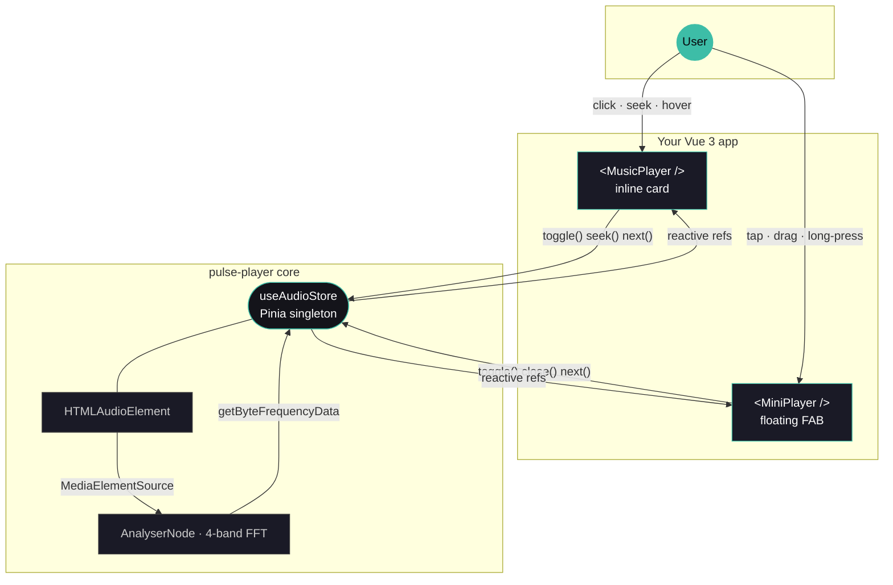

<div align="center">

<br>

# pulse-player

### A Vue 3 music player that grows with the page.

<br>

[](https://vuejs.org/)
[](https://www.typescriptlang.org/)
[](https://pinia.vuejs.org/)
[](./LICENSE)
[](#size)

<br>


<br>

**A drop-in inline card.** &nbsp;·&nbsp; **A floating draggable FAB.** &nbsp;·&nbsp; **One global audio session.**
<sub>Every visible dimension scales from a single CSS variable.</sub>

<br>

</div>

---

## Why pulse-player

Most music components either look great at one size and fall apart everywhere
else, or they hardcode a stretched mobile look onto every breakpoint.
`pulse-player` solves that by **scaling itself** — artwork, title, NOW PLAYING
label, GitHub / Spotify icons, prev / next buttons, padding, border-radius,
shadows, EQ bars, progress bar and gaps are all derived from a single CSS
custom property, written inline by a `ResizeObserver`.

The result: the same component looks intentional in a 280 px sidebar, a 480 px
tablet panel, and a 720 px hero — without you ever touching a media query.

<br>

### Features at a glance

| | |
|---|---|
| **Two components** | A full inline `<MusicPlayer />` and a floating `<MiniPlayer />` FAB, sharing the same global session. |
| **Truly proportional** | One CSS variable scales every dimension at once. Artwork, type, chrome and shadows breathe together. |
| **Container-aware** | Sizes itself off its container, not the viewport. Sidebar, hero or modal — it always looks intentional. |
| **9 background variants** | `auto` · `vinyl` · `sunset` · `midnight` · `aurora` · `dark` · `light` · `transparent` · `custom`. |
| **Themable accent** | One `accentColor` prop or one `--pulse-accent` CSS variable retunes EQ + progress hue. |
| **Persistent session** | One Pinia store, one `<audio>`. Mount the FAB at the app root, playback survives every route change. |
| **FFT equalizer** | 4-band Web Audio API analyser, smoothed. Try / catch wrapped — playback never breaks. |
| **Tiny** | ~42 kB gzipped (JS + CSS combined). Zero business / domain code. |

<br>

---

## Background variants

Nine curated presets ship in. Pass `accentColor` to retune the EQ + progress
hue. The premium showcase below uses the warm-cream <em>"a couple of good
days"</em> cover; the variant gradient sits behind the player while the live
artwork remains crisp.

<br>

<table>
  <tr>
    <td align="center">
      
      <br><sub><strong>Vinyl</strong> · <code>variant="vinyl"</code> — warm analog, gold border, vinyl + leather</sub>
    </td>
  </tr>
  <tr>
    <td align="center">
      
      <br><sub><strong>Sunset</strong> · <code>variant="sunset"</code> — sepia / brown gradient, amber accent</sub>
    </td>
  </tr>
  <tr>
    <td align="center">
      
      <br><sub><strong>Midnight</strong> · <code>variant="midnight"</code> — deep navy → violet, violet accent</sub>
    </td>
  </tr>
  <tr>
    <td align="center">
      
      <br><sub><strong>Aurora</strong> · <code>variant="aurora"</code> — teal · cyan night, cyan accent</sub>
    </td>
  </tr>
  <tr>
    <td align="center">
      
      <br><sub><strong>Light</strong> · <code>variant="light"</code> — inverted palette for light-mode apps</sub>
    </td>
  </tr>
</table>

Also available: `auto` (default — live cover-art blur backdrop),
`transparent` (frameless — sits over your own background), `dark` (pure
neutral surface), `custom` (use any CSS background via `customBackground`).

<br>

---

## Install

```bash
git clone https://github.com/YamadaBlog/pulse-player.git
cd pulse-player
npm install
npm run dev       # http://localhost:5174 — demo with the live size slider
```

To consume the library in your own Vue 3 app, copy [`src/lib/`](./src/lib)
into your project — it has no other source dependency. Then:

```bash
npm install vue pinia lucide-vue-next
```

```ts
// main.ts
import { createApp } from 'vue'
import { createPinia } from 'pinia'
import App from './App.vue'

createApp(App).use(createPinia()).mount('#app')
```

That is the only setup step. No provider, no plugin registration.

<br>

---

## Usage

```vue
<script setup lang="ts">
import { MusicPlayer, MiniPlayer, useAudioStore } from './lib'

const store = useAudioStore()
</script>

<template>
  <!-- Inline card — embed anywhere. Both icons appear by default. -->
  <MusicPlayer
    variant="vinyl"
    accent-color="#C8A97E"
    github-url="https://github.com/your-handle"
    spotify-url="https://open.spotify.com/album/..."
  />

  <!-- Your own controls — the store is the only contract. -->
  <button @click="store.toggle">
    {{ store.isPlaying ? 'Pause' : 'Play' }}
  </button>

  <!-- Mount ONCE near the app root — persists across every navigation. -->
  <MiniPlayer variant="midnight" />
</template>
```

<br>

---

## Sizing — one variable to rule them all

The component watches its own container with a `ResizeObserver`. From the
container width it computes a unitless scale factor `0.75 … 1.80` and writes
it inline to `--pulse-scale`. All dimensions are CSS `calc()` of a base
value × `var(--pulse-scale)`:

```css
.mp {
  --pulse-scale: 1;                       /* set inline by JS or by `size` prop */

  --pulse-pad:    calc(14px  * var(--pulse-scale));
  --pulse-radius: calc(18px  * var(--pulse-scale));
  --pulse-art:    calc(136px * var(--pulse-scale));
  --pulse-title:  calc(26px  * var(--pulse-scale));
  --pulse-icon:   calc(17px  * var(--pulse-scale));
  --pulse-btn:    calc(34px  * var(--pulse-scale));
  --pulse-bar-h:  calc(3px   * var(--pulse-scale));
  /* …and a dozen more — see src/lib/MusicPlayer.vue */
}
```

The auto-scale curve, in plain numbers:

| Container | `--pulse-scale` | Artwork | Title | Icon |
|---|---:|---:|---:|---:|
| 280 px (mobile sidebar) | 0.75 | 102 px | 20 px | 13 px |
| 360 px (mobile / tablet) | 0.89 | 121 px | 23 px | 15 px |
| 480 px (tablet) | 1.10 | 150 px | 29 px | 19 px |
| 720 px (desktop hero) | 1.52 | 207 px | 40 px | 26 px |
| 800 px (large hero) | 1.66 | 226 px | 43 px | 28 px |

The artwork stays at **~33 %** of the container width across the entire range
— matching the proportions of the original dashboard component.

Pass the `size` prop (a number) to override the auto-scale entirely:

```vue
<MusicPlayer :size="0.75" />   <!-- compact sidebar -->
<MusicPlayer :size="1.0"  />   <!-- card -->
<MusicPlayer :size="1.7"  />   <!-- hero -->
```

<br>

---

## Architecture

One Pinia store owns the entire audio session: a singleton `<audio>` element,
the Web Audio analyser, and the reactive state. The two visual components
are pure projections — mounting / unmounting them never affects playback.



<details>
<summary><strong>What lives where</strong></summary>

| Layer | Owns | Type |
|---|---|---|
| `useAudioStore` | the `<audio>` element, the `AudioContext` + `AnalyserNode`, reactive state | Pinia store (singleton) |
| `MusicPlayer.vue` | the inline card layout, all CSS variables tied to `--pulse-scale` | Vue 3 SFC |
| `MiniPlayer.vue` | the floating FAB, drag/swipe gestures, radial menu, progress ring | Vue 3 SFC (Teleport to body) |
| `setAudioTracks(tracks)` | replace the playlist before mount | function |

Mounting either component twice on the same page is fine — they all read /
write the same store, so they stay in sync automatically.

</details>

<br>

---

## API reference

### `<MusicPlayer />`

| Prop | Type | Default | Description |
|---|---|---|---|
| `variant` | `'auto' \| 'transparent' \| 'solid' \| 'dark' \| 'light' \| 'sunset' \| 'midnight' \| 'aurora' \| 'vinyl' \| 'custom'` | `'auto'` | Background preset. |
| `customBackground` | `string` | — | Any CSS `background` value (gradient, image, …). Used when `variant="custom"`. |
| `accentColor` | `string` | — | Overrides the local accent (EQ bars, scrub hover, focus ring). |
| `githubUrl` | `string` | — | If set, the GitHub icon becomes a link. Without it, the icon is decorative. |
| `spotifyUrl` | `string` | — | If set, the Spotify icon becomes a link (album, playlist, profile). Without it, decorative. |
| `hideIcons` | `boolean` | `false` | Hide both icons entirely. |
| `size` | `number` | _(auto)_ | Override the auto-responsive scale. Range `0.6` – `1.8`. |

### `<MiniPlayer />`

| Prop | Type | Default | Description |
|---|---|---|---|
| `variant` | same set as `MusicPlayer` | `'auto'` | `'auto'` shows the cover art inside the circle; presets fill with a solid / gradient. |
| `customBackground` | `string` | — | CSS background for `variant="custom"`. |
| `accentColor` | `string` | — | Overrides the ring + EQ accent locally. |
| `size` | `number` | `56` | FAB diameter in pixels (min recommended 40). |
| `offset` | `{ bottom?: number; right?: number }` | `{ bottom: 32, right: 16 }` | Position offset from the bottom-right corner. |

### `useAudioStore()`

| | Type | Notes |
|---|---|---|
| `currentTrack` | `number` | Index in the playlist. |
| `isPlaying` | `boolean` | Live playback flag. |
| `currentTime` / `duration` | `number` | Seconds. |
| `progress` | `number` (computed) | `0–100`. |
| `eqBars` | `number[]` | 4-band FFT energies, `0–1`. |
| `track` / `tracks` | computed | Current `Track` / full playlist. |
| `isVisible` | `boolean` | Whether the floating FAB should render. |
| `hasBeenOpened` | `boolean` | `true` after the user starts playback at least once. |

| Action | Effect |
|---|---|
| `toggle()` | Initialize audio on first call, then play ↔ pause. Flips `isVisible` on first play. |
| `next()` / `prev()` | Wraps to start/end. `prev` restarts the current track if `currentTime > 3s`. |
| `loadTrack(i)` | Jump to track `i`. Keeps playing if already playing. |
| `seek(fraction)` | `fraction ∈ [0, 1]`. |
| `open()` / `close()` | Show / hide the floating FAB (`close` also pauses). |
| `fmt(seconds)` | Format helper returning `m:ss`. |

### Customizing the playlist

```ts
// main.ts — BEFORE the app mounts
import { setAudioTracks } from './lib'

setAudioTracks([
  { title: 'YOUR TRACK',  src: '/music/01.mp3', cover: '/img/01.jpg', coverPos: '50% 40%' },
  { title: 'ANOTHER ONE', src: '/music/02.mp3', cover: '/img/02.jpg', coverPos: 'center', coverScale: 1.1 },
])
```

```ts
interface Track {
  title: string        // shown in the inline player
  src: string          // any browser-supported codec
  cover: string        // cover image URL
  coverPos: string     // CSS object-position (e.g. '50% 60%')
  coverScale?: number  // optional CSS scale applied to the cover (1.25 = +25 % zoom)
}
```

<br>

---

## Theming

Two CSS variables expose the global look:

```css
:root {
  --pulse-accent: #ff3da8;   /* EQ bars, progress ring, scrub hover, focus */
  --pulse-bg:     #0e0e14;   /* `solid` variant background */
}
```

Both components fall back to teal (`#3DBDA7`) when the variables are
absent, so they work out of the box without theming work.

Per-instance overrides via props always take precedence:

```vue
<!-- Vinyl Dark — warm analog with gold accent -->
<MusicPlayer variant="vinyl" accent-color="#C8A97E" />

<!-- Midnight with a Spotify deep link -->
<MusicPlayer
  variant="midnight"
  accent-color="#8B5CF6"
  spotify-url="https://open.spotify.com/playlist/37i9dQZF1DXcBWIGoYBM5M"
/>

<!-- Fully custom background -->
<MusicPlayer
  variant="custom"
  :custom-background="'linear-gradient(135deg, #2c1610 0%, #4a2c1f 45%, #6b4226 100%)'"
  accent-color="#E8A87C"
/>

<!-- Sidebar widget — pinned compact, no icons -->
<MusicPlayer variant="dark" :size="0.75" hide-icons />

<!-- Bigger FAB, pinned higher -->
<MiniPlayer variant="aurora" :size="72" :offset="{ bottom: 56, right: 24 }" />
```

<br>

---

<a id="size"></a>

## Size & dependencies

**Runtime:**
- `vue` ^3.4 — composition API + `<script setup>` + `<Teleport>`
- `pinia` ^2.1 — state management
- `lucide-vue-next` ^0.300 — icons (`Play`, `Pause`, `SkipBack`, `SkipForward`, `X`)

**Browser APIs:**
- `HTMLAudioElement`
- Web Audio API — `AudioContext` + `AnalyserNode` + `MediaElementAudioSourceNode` (try/catch wrapped — bars stay flat if unavailable)
- `ResizeObserver` — drives the auto-scale
- Vue 3 `<Teleport>` — drives the FAB mount-to-body

**Build / dev only:** `vite ^5`, `@vitejs/plugin-vue ^5`, `typescript ^5.4`, `vue-tsc ^2`.

> ⚠ `vue-tsc 1.x` is incompatible with TypeScript 5.3+ (`supportedTSExtensions` crash). Use `^2`.

**Bundle:** ~102 kB JS + ~23 kB CSS · **~42 kB gzipped combined**.

<br>

---

## Limitations

- **One global `<audio>` element.** For two independent players on the same
  page, clone the store with a different `defineStore` id.
- **CORS for the FFT.** The analyser requires CORS-enabled responses when
  the source is cross-origin (`MediaElementAudioSourceNode` quirk).
  Playback still works; only the EQ bars stay flat.
- **First play must follow a user gesture** (standard browser autoplay
  policy).
- The default UI ships **prev / next + scrub** only. Volume, shuffle and
  repeat are not in the chrome — the store actions exist, wire your own
  controls if you need them.

<br>

---

## Roadmap

- [ ] Volume slider + mute on the inline card
- [ ] Shuffle / repeat modes
- [ ] Persist `currentTrack` + `currentTime` to `localStorage`
- [ ] Keyboard shortcuts (`Space`, `←`, `→`)
- [ ] Media Session API (hardware media keys + lock-screen art)
- [ ] Waveform variant (canvas-rendered alternative to the EQ bars)
- [ ] Publish as a standalone npm package

<br>

---

## License

[MIT](./LICENSE). The two demo tracks under `public/audio/` are shipped
for local testing only and are **not** part of the MIT-licensed source —
replace them with content you own before redistributing.

<br>

<div align="center">

<sub>Built with Vue 3, Pinia, a ResizeObserver and a small amount of obsessive proportional tuning.</sub>

</div>
