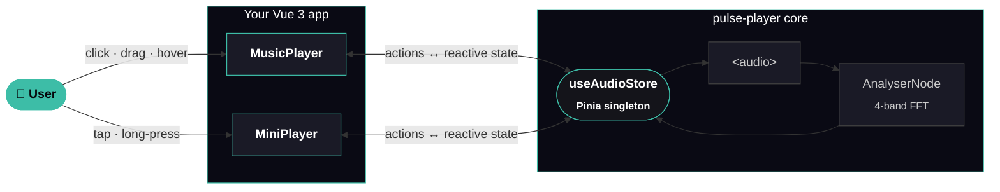

# Architecture

[← back to README](../README.md)

One Pinia store owns the entire audio session: a singleton `<audio>`, the Web Audio analyser, and the reactive state. The two visual components are pure projections — mount and unmount them freely, nothing ever stops playback.



## What lives where

| Layer | Owns | Type |
|---|---|---|
| `useAudioStore` | the `<audio>` element, the `AudioContext` + `AnalyserNode`, reactive state, all actions | Pinia store (singleton) |
| `MusicPlayer.vue` | the inline card layout, all CSS variables tied to `--pulse-scale` | Vue 3 SFC |
| `MiniPlayer.vue` | the floating FAB, drag/swipe gestures, radial menu, progress ring | Vue 3 SFC (Teleport to body) |
| `setAudioTracks(tracks)` | replace the playlist before mount | function |

## Why one store

- **Persistent session.** Playback state lives outside the Vue component tree, so it survives every route change.
- **Always in sync.** Mount three `<MusicPlayer />` and one `<MiniPlayer />` on the same page — they all read the same store, no glue required.
- **One source of truth.** Components don't own audio state, they project it. Mount / unmount never breaks playback.

## Audio chain

```
HTMLAudioElement
   │
   ▼  audioContext.createMediaElementSource()
MediaElementAudioSourceNode
   │
   ▼  sourceNode.connect(analyser)
AnalyserNode (FFT, fftSize=32, smoothing=0.7)
   │
   ▼  analyser.connect(audioCtx.destination)
Audio output
   │
   │  (also)
   ▼  analyser.getByteFrequencyData() — every frame
eqBars: [4 floats 0..1] → reactive state
```

The analyser is wrapped in a `try / catch` — if the browser refuses the connection (cross-origin without CORS, missing API, …) the bars stay flat but **playback still works**.

## Browser support

| API | Notes |
|---|---|
| `HTMLAudioElement` | universal |
| Web Audio (`AudioContext`, `AnalyserNode`, `MediaElementAudioSourceNode`) | needed only for the EQ bars; degrades silently |
| `ResizeObserver` | drives the auto-scale (Safari 13.1+, all evergreen browsers) |
| Vue 3 `<Teleport>` | drives the FAB mount-to-body |
