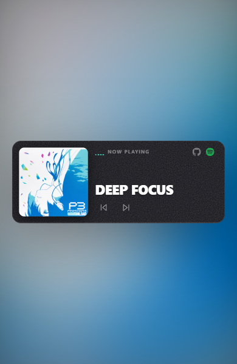
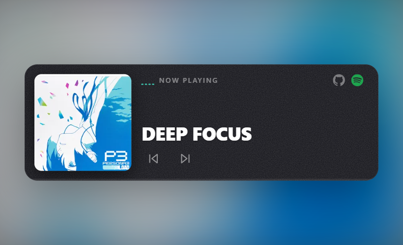
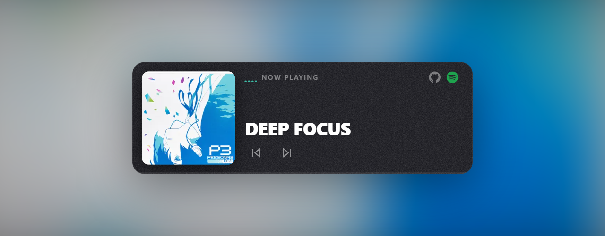
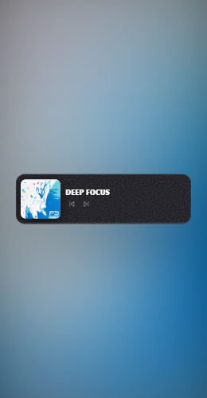

# Responsive design

[← back to README](../README.md)

`pulse-player` watches its own container with a `ResizeObserver` and writes a unitless scale factor inline to `--pulse-scale`. Every visible dimension — artwork, title, NOW PLAYING label, icons, buttons, padding, border-radius, shadows, EQ bars, progress and gaps — is `calc(base × var(--pulse-scale))`. The result is a component that **actually grows** with its container, not a stretched mobile one.

## The three breakpoints

### Mobile (≤ 420 px container)



- Artwork at ~33 % of the container width — same proportions as the original dashboard.
- Title left-aligned next to the artwork.
- All icons visible until the container drops below the compact threshold.

### Tablet (~ 480 – 900 px container)



- Same layout, larger everything.
- Artwork holds its 33 % ratio; the body breathes.

### Desktop (≥ 720 px container)



- Title sits flush left next to the artwork (not centered).
- Bigger artwork, larger type, deeper chrome — proportional to scale.

## The scale curve

| Container width | `--pulse-scale` | Artwork | Title | Icon |
|---:|---:|---:|---:|---:|
| 240 px | 0.69 | _compact mode_ | _compact mode_ | _hidden_ |
| 280 px | 0.75 | 102 px | 20 px | 13 px |
| 360 px | 0.89 | 121 px | 23 px | 15 px |
| 480 px | 1.10 | 150 px | 29 px | 19 px |
| 720 px | 1.52 | 207 px | 40 px | 26 px |
| 800 px | 1.66 | 226 px | 43 px | 28 px |

## Compact mode



Below **240 px** of container width the layout collapses to a compact strip — artwork + title + prev/next. NOW PLAYING and the secondary icons are hidden to keep the title readable. Toggle and seek still work as expected, so the component never breaks visually no matter how narrow you make it.

The threshold lives in `src/lib/MusicPlayer.vue`:

```ts
const COMPACT_THRESHOLD = 240
```

## Manual override

If the auto-scale doesn't match what you need, pass the `size` prop. A number between `0.6` and `1.8`. Auto-scale stops driving the variable as soon as `size` is set.

```vue
<MusicPlayer :size="0.75" />   <!-- compact sidebar -->
<MusicPlayer :size="1.0"  />   <!-- card -->
<MusicPlayer :size="1.7"  />   <!-- hero -->
```
